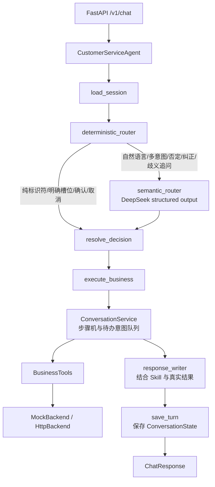

# 架构说明

`CustomerServiceAgent` 是 API 的唯一入口，`CustomerServiceWorkflow` 构建并编译外层 `StateGraph`。当前配置使用 `deepseek-v4-flash`：`semantic_router` 按 DSL 基线对自然语言、新场景、多意图、语义追问、否定、纠正和切换输出受 Pydantic 约束的计划；纯运单号、手机号后四位、地址、工单号和写操作确认从条件边直接跳过模型。语义计划包含一个当前主意图、最多三个次要意图及其并列/顺序/条件/备选/纠正关系。`response_writer` 对已完成的查询和写结果做第二次有事实约束的自然回复生成，`save_turn` 最后才把用户消息和最终回复写入历史。

Graph 负责确定节点执行顺序，`ConversationService` 仍是业务规则的唯一执行者。Tool 返回后，可选的模型调用结合当前问题、最近对话、对应 Skill 和真实结果生成自然回复；若模型不可用或回复校验失败，系统使用安全模板。

## 状态边界

- 会话键：`session_id`。
- Checkpointer 同时保存显式业务状态、一个活动场景、待办意图队列、最近六组用户/助手消息、会话中出现过的运单号与工单号；队列推进复用已验证的运单号，但场景切换会清理手机号和地址等敏感场景槽位。会话所有者变化时全部清空。
- `user_credential` 只沿当前请求传到 Tool/Adapter，不写入状态、Prompt 或日志。
- 每个会话独立加锁，防止同一会话并发确认造成重复写入。

## 写操作保护

写操作统一采用：收集参数 -> 查询/校验 -> 展示动作 -> `waiting_confirmation` -> 用户确认 -> 再校验 -> 带幂等键执行 -> 审计。查询类失败可有限重试，写操作不自动重试。

## 多意图边界

- 多个只读诉求按计划顺序执行，并在一个回复中返回结构化 `results`。
- 查询与写操作共存时，先完成查询，再进入写操作的参数收集和确认。
- 多个写操作逐个处理，每个操作单独确认并使用独立幂等键。
- “或者”等备选关系不会擅自执行，系统先让用户选择。
- 模型不可用时，清晰的多意图按用户提及顺序降级；包含否定或纠正时只澄清，不依据关键词执行。

## LangGraph 集成

项目直接使用 `StateGraph`、`START`、`END` 和条件边。Graph 单轮状态由 `CustomerServiceGraphState` 定义，包含请求、业务 State、规则决策、模型决策、合并决策和响应。`ConversationCheckpointer` 继续作为唯一持久业务状态源，并在整个 Graph 调用期间持有会话锁；这样不会同时维护两份对话记忆，也不会把 `user_credential` 写进 Graph 或会话状态。生产环境可将这一协议实现替换为 Redis/PostgreSQL。

语义节点直接调用模型的结构化输出接口，不向模型开放业务 Tool。包内 Skill 的紧凑目录进入语义 Prompt，最终回复阶段才读取当前场景的完整 Skill；Tool 选择、高风险操作和状态跳转仍由业务步骤机守门。

DeepSeek 连接失败会开启短暂冷却，避免每条消息反复等待网络重试。冷却期间确定性 Router、会话级标识符历史和三语无 Tool 回复继续工作；不会因为“额”、感谢、夸奖或询问历史而累计失败并错误转人工。

路由模型和回复模型使用独立冷却通道；一次结构化解析失败不会关闭后续的自然回复。模型将空字段错误序列化为 `"null"`、`"None"` 或空字符串时，Pydantic 前置校验会统一转换成真正的空值。

## 替换点

- Checkpointer：实现 `ConversationCheckpointer` 协议。
- 业务系统：实现 `BusinessBackend` 协议或配置 `HttpBackend`。
- 模型：通过 `MODEL_NAME`、`MODEL_BASE_URL`、`MODEL_API_KEY` 或 `DEEPSEEK_API_KEY` 切换 OpenAI-compatible 服务。
- FAQ：替换 Backend 的 `retrieve_faq` 为内部知识库/MCP，不改上层 Tool 契约。
