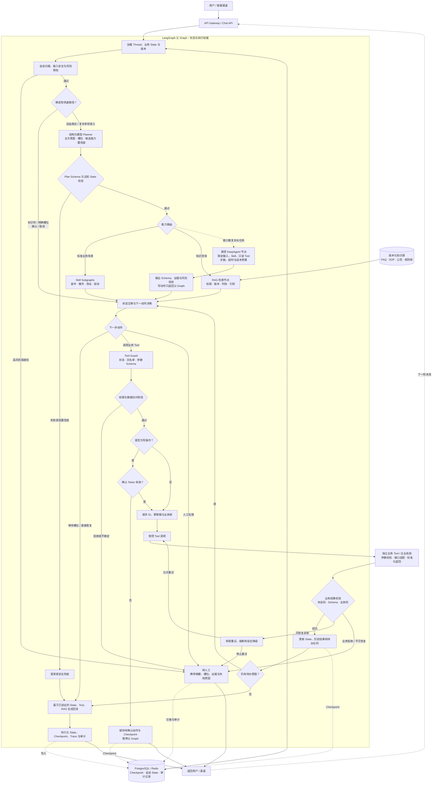
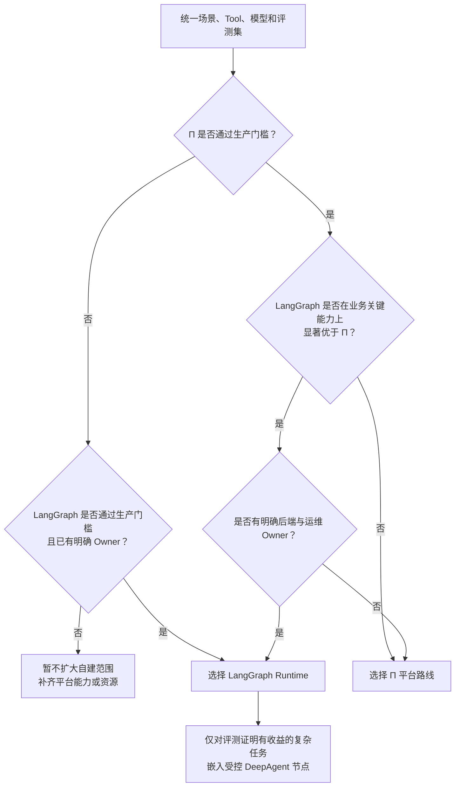

# 智能客服 Agent 技术路线调研与选型建议

## 1. 调研结论

过去两周完成了三条智能客服技术路线的可运行 Demo，并使用普通客服、多轮上下文、多意图和复杂长任务进行对比验证。

| 技术路线 | 定位 | 验证结论 | 当前建议 |
| --- | --- | --- | --- |
| Π 大模型平台 | 平台托管型受控 Agent | 若会话、知识库、发布、日志和运营能力已经成熟，近期交付成本和风险最低 | 保留为生产候选路线 |
| LangGraph | 代码自持型 Agent Runtime | 显式 State 和条件边已完成验证；生产级 Checkpoint、Skill Subgraph 和复杂节点嵌入仍待建设 | 保留为长期核心 Runtime 候选 |
| DeepAgents | 高自主性 Agent Harness | 动态规划、Skill、子 Agent、上下文管理和进程内暂停恢复在原型层面成立 | 不作为当前主框架；未来只作为受控节点使用 |

本次调研不建议仅凭 Demo 回复自然度决定框架。真正的选型对象是两套完整生产方案：

1. **Π 平台 + Skill/场景能力模块 + 独立业务 Tool**；
2. **LangGraph Runtime + 有限状态机 + 结构化模型 Planner + Skill Subgraph + 独立业务 Tool，并按需嵌入受控 DeepAgent**。

两条路线遵循同一个原则：

> **大模型负责理解和规划，状态机与执行守门层负责流程、权限和确认，业务 Tool 与后端负责真实数据、幂等和审计。**

一句话结论：**在平台能力验收通过的前提下，Π 是交付效率优先的生产基线；LangGraph 是控制力和长期演进优先的候选底座；DeepAgents 是少量复杂任务的能力增强器。**

## 2. 调研范围与验证方法

### 2.1 三条路线

- **Π 大模型平台**：核验平台是否具备支撑客服快速交付所需的工作流、模型、会话、知识、接口和运营能力。
- **LangGraph**：验证能否使用显式 Graph 和结构化 State 构建可测试、可恢复、可审计的受控 Agent Runtime。
- **DeepAgents**：验证动态 Skill、任务分解、子 Agent 委派和长任务暂停恢复是否能为复杂客服任务带来额外价值。

### 2.2 三套 Demo 合计覆盖场景

| 场景类别 | 代表性验证内容 | 重点观察 |
| --- | --- | --- |
| 标准客服 | 查件、催派、签收未收到、改址、投诉、FAQ、转人工 | 意图、槽位、Tool 调用和回复质量 |
| 多轮上下文 | “怎么这么慢”“能再催一下吗”、指代、纠正、取消、切换场景 | 上下文保持、重复询问和状态连续性 |
| 多意图 | 同时查件和改址、多个只读或写诉求逐项处理 | 主次意图、共享槽位、待办队列和逐项确认 |
| 复杂长任务 | 一单四包裹综合处理、跨境海关异常调查 | 动态规划、专业子 Agent、材料补充、暂停恢复和重规划 |
| 安全与异常 | 写操作确认、重复提交、模型或 Tool 失败、低置信度 | 越权风险、幂等、降级和人工接管 |

三套 Demo 提供了**初步可行性证据并暴露了能力差异**，不代表已经达到生产可用，也不代表每条路线都完整覆盖表中全部场景。最终选型还需要在统一模型、统一 Tool、统一数据和统一评测集下补充量化结果。

## 3. 三条路线的验证结论

### 3.1 Π 大模型平台

Π 路线的核心价值是复用公司现有平台能力。如果平台已经稳定提供会话、知识库、模型配置、工作流、发布、日志和运营后台，则项目团队可以把主要精力放在业务 Tool 和客服规则上，近期上线风险最低。

需要注意：Π 是公司私有平台，不能直接把其他平台的能力映射为 Π 的既有能力。以下内容必须通过平台文档和专项 Demo 确认：

- 多轮会话 State 是否持久、隔离、可恢复；
- 多意图待办队列和多次确认是否容易维护；
- RAG 是否支持来源、版本、权限和无答案兜底；
- Skill 是否能通过原生能力、子流程、插件或外部服务模块化；
- Prompt、流程、变量和知识是否可版本化、测试、灰度和回滚；
- Tool 白名单、身份传递、超时、审计和 Trace 是否满足生产要求。

因此，“Π 平台后续支持 Skill”应理解为**补充可版本化、可测试、可限制 Tool 的场景能力模块**，不要求复制 DeepAgents 的 `SKILL.md` 机制。

### 3.2 LangGraph

当前 LangGraph Demo 已验证以下能力：

- 使用显式 `StateGraph` 固定处理阶段和状态迁移；
- 确定性输入直接走快速路径，自由表达才调用结构化模型 Planner；
- 使用一个活动场景和待办意图队列逐项处理多意图；
- 写操作经过收集、校验、展示、确认、复核、幂等执行和审计；
- 按场景读取 `SKILL.md`，将场景说明用于语义和回复节点；
- 模型不直接持有业务 Tool 的最终执行权；

当前会话仍由进程内 `InMemoryConversationCheckpointer` 保存，尚未验证服务重启、跨实例恢复或生产并发；当前也没有真正的 Skill Subgraph 和嵌入式 DeepAgent 节点。在目标架构中，稳定场景可进一步封装为 Skill Subgraph，极少数复杂任务才进入父 Graph 中的受控 DeepAgent 节点。

LangGraph 的优势来自显式控制和代码工程，而不是“用了框架就自动具备生产后端”。开源框架提供 State、Graph、Checkpoint、Interrupt 和 Subgraph 原语；API 服务、持久化数据库、并发控制、鉴权、RAG 运营、监控和发布仍需团队落地。

### 3.3 DeepAgents

DeepAgents 的动态规划、Skill 渐进加载、子 Agent 委派和长任务能力在原型中成立，适合路径难以提前枚举、上下文量大或需要跨专业调查的任务。但当前大部分客服业务仍是路径明确的标准流程，以 DeepAgents 作为总控制器会增加模型调用、时延、路径不确定性和评测治理成本，现有结果尚未证明收益足以覆盖这些代价。因此，DeepAgents 不进入主框架候选，只保留为未来的受控增强能力。

## 4. “受控 Agent”的责任边界

| 组件 | 负责 | 不负责 |
| --- | --- | --- |
| 结构化模型 Planner | 语义理解、主次意图、上下文指代、候选槽位、能力建议、置信度 | 最终权限判断和直接执行高风险写操作 |
| 有限状态机 / 父 Graph | 当前场景、步骤、待办队列、确认、取消、切换、失败跳转和暂停恢复 | 生成未经 Tool 验证的业务事实 |
| Skill / Subgraph | 一个客服场景的 Schema、SOP、允许 Tool、确认规则和测试 | 绕过全局安全策略 |
| RAG | 返回带来源、版本和权限过滤的知识证据 | 替代实时业务接口或在无证据时强行回答 |
| Tool Guard | 校验当前 State、参数 Schema、Tool 白名单、权限和确认条件 | 代替业务系统的最终授权 |
| 业务 Tool / 后端 | 提供真实结果，执行权限、幂等、超时处理和审计 | 依赖模型记忆判断业务是否成功 |
| DeepAgent 节点 | 少量复杂任务的动态调查、分解和证据汇总 | 获得父 Graph 之外的无限工具权和最终写权限 |

确定性快速路径包括：运单号格式、手机号后四位、工单号、明确等待的槽位、独立的确认或取消、幂等参数和当前步骤跳转。这些信息不需要再次调用模型。

## 5. LangGraph 目标技术架构

> **以下是推荐的生产目标架构，不是当前 Demo 的已实现清单。当前 Demo 使用进程内会话状态；独立 Tool Guard、企业 RAG、持久数据库、生产熔断、完整人工交接和 DeepAgent 嵌入仍待建设。DeepAgents Spike 目前是 `main` 分支的独立入口，尚未嵌入 LangGraph 父 Graph。**

目标设计要求：

1. 父 Graph 始终是业务 State 和最终执行权威；
2. Planner 只输出结构化语义计划，输出必须经过 Schema 与 State 校验；
3. 标准客服 Skill 使用 Subgraph/Registry，实现独立 Schema、流程、Tool 白名单和测试；
4. DeepAgent 只能返回结构化调查结果、证据和动作建议，写操作必须回到父 Graph；
5. 每次关键状态迁移都应持久化，确保重启、人工接管和长任务中断后可以恢复；
6. 异常由有限重试、熔断、安全降级或人工接管处理，不交给模型无限循环。

## 6. 两条生产候选路线对比

### 6.1 比较前提

Π 与 LangGraph 不属于完全相同的产品层级：Π 是公司平台化能力，LangGraph 是低层代码编排框架和 Runtime 基础。因此必须比较完整生产方案，而不能只比较框架 API 或单次对话效果。

下表中 Π 的平台能力均以“平台已经提供并通过验收”为前提，不能把其他大模型平台的能力直接视为 Π 的现成功能。

| 维度 | Π 平台 + Skill/场景模块 | LangGraph Runtime + 受控 DeepAgent | 选型影响 |
| --- | --- | --- | --- |
| 核心定位 | 平台托管；若相关能力通过验收，可组合模型、会话、知识和流程 | 代码自持，以显式 State、Node、Edge 和 Subgraph 构建 Runtime | 前者降低初期建设，后者提高控制力 |
| 近期交付 | 若平台能力成熟，接入和发布周期更短 | 当前 Demo 已具备 LangGraph 主链路和薄 FastAPI；生产主要接入共享会话缓存、真实 Tool 与公司标准部署/观测能力 | Π 仍有平台交付优势，但 LangGraph 不需要重建整体客服后端 |
| 语义 Planner | 取决于结构化输出、模型配置和 Tool 约束能力，需实测 | Planner 可作为普通节点，输入输出 Schema 和失败路径由代码约束 | LangGraph 边界更明确 |
| 状态机与多意图 | 若平台提供相应节点和变量，可实现工作流；复杂队列、暂停恢复和多次确认的维护性需验证 | Typed State、Graph 和 Subgraph 可显式表达队列、确认、中断和恢复 | 状态复杂度越高，LangGraph 优势越明显 |
| Skill/场景模块 | 可映射为平台原生能力、子流程、插件或外部服务；版本和权限边界待确认 | Skill Registry + Subgraph 适合稳定 SOP，接口和 Tool 白名单可代码化 | 不应只比较是否叫“Skill” |
| DeepAgent 扩展 | 取决于平台是否允许内嵌节点或外部 Agent 服务；状态和 Trace 可能分散 | 可作为父 Graph 的受控节点，统一输入、Checkpoint、输出和执行守门 | LangGraph 更适合统一控制复杂节点 |
| 会话与持久化 | 若平台提供 Thread、隔离、TTL、并发和恢复，可直接复用 | 接入公司 Redis/统一会话服务；Agent 侧维护 State Schema、TTL 策略和同会话并发语义 | 属于必要的应用接入工作，不等于自建持久化平台 |
| RAG | 若已有摄取、分块、Embedding、检索、权限和运营后台，优势显著 | 可灵活连接企业 RAG，但本身不是完整知识运营平台 | 已有成熟知识平台时不应重复建设 |
| Tool 与业务安全 | 平台可负责编排；最终权限、确认、幂等和审计仍由业务后端负责 | 父 Graph 可增加细粒度 Guard；最终业务安全同样由 Tool/后端负责 | 两条路线都不能省掉业务后端 |
| 自动化测试 | 取决于流程导出、版本 Diff、节点测试、回放和回滚能力 | State、Node、Subgraph 和 Tool 契约可进入代码评审、单测和 CI | 核心流程频繁迭代时 LangGraph 更自然 |
| 可观测与运营 | 若平台已有日志、Trace、指标和配置后台，运营效率更高 | 复用公司日志、指标和 Trace 平台，Agent 侧补充模型、路由、状态迁移和 Tool 指标 | Π 的优势主要在现成运营界面，LangGraph 的增量是 Agent 专项观测 |
| 运营参与 | 可视化能力成熟时，产品和运营可参与知识、Prompt 和流程维护 | 默认更依赖研发，可通过配置中心和 Skill 元数据降低依赖 | 业务变更频繁时 Π 更有优势 |
| 可定制性 | 受平台节点、插件、运行模型和发布机制约束 | 状态、调度、恢复、安全策略和集成方式均可代码级定制 | 应以真实平台缺口判断是否需要自由度 |
| 平台依赖 | 流程、变量、知识和日志可能绑定平台，需验证导出和迁移 | 仍有框架依赖，但 State、Tool 契约和测试资产更容易自主掌控 | 两条路线都应保持统一 API/Tool 契约 |
| 后端与运维投入 | 平台承担更多通用能力；业务 Tool 后端仍不可少 | 在整体客服服务、业务 Tool 和基础设施由其他团队提供的前提下，新增工作主要是薄 Agent API、会话 State 接入、Agent 专项观测和版本测试 | 增量投入可控，但跨团队接口与运行责任必须明确 |
| 成本与时延 | 包含平台费用和模型调用，优化空间取决于平台开放程度 | 主要成本是模型调用与 Agent 服务维护，可通过确定性快速路径减少模型调用 | 应比较平台费用、研发维护和 P95 时延，而不能预设 LangGraph 基础设施成本显著更高 |

### 6.2 LangGraph 相比 Π 的核心优劣势

**核心优势：**

1. 当前客服处理涉及多意图、槽位补充、用户确认、接口调用和异常恢复等复杂状态。LangGraph 使用显式 State 和 Graph 编排，流程控制、代码评审、自动化测试和问题复现能力更强。
2. LangGraph 更便于后续扩展 Planner、Skill Subgraph、场景 Agent 或受控 DeepAgent，适合逐步承接复杂任务规划和多工具协同，同时由父 Graph 保留最终执行权。

**主要劣势：**

LangGraph 是代码框架而不是开箱即用的运营平台，默认缺少 Π 平台可能已有的可视化编排、Prompt/模型配置、知识运营、发布管理和运行日志界面。Agent 团队需要通过代码维护 Graph、State Schema、Prompt、自动化测试及版本发布，流程调整对研发依赖更高，产品和运营的自助能力较弱。同时还需完成共享会话缓存、公司监控平台和业务 Tool API 的轻量接入，但在整体客服服务、业务 Tool 和通用基础设施均由现有团队提供的前提下，这部分属于标准应用集成，不是建设完整客服后端，工作量和维护成本总体可控。

对比结论：**Π 的主要优势是平台能力验收通过后的交付与运营效率，主要风险是复杂状态、测试和扩展能力受平台边界约束；LangGraph 的主要优势是显式控制、代码级测试和复杂节点扩展，主要代价是代码维护与运营自助能力较弱，并需要 Agent 团队维护会话 State 接入、模型与 Graph 治理。现有客服后端、业务 Tool、幂等审计和公司基础设施不应重复计入 LangGraph 的建设成本。**

## 7. DeepAgent 作为受控节点

### 7.1 准入条件

只有同时满足以下条件，任务才进入 DeepAgent：

1. 执行路径无法合理预先枚举，普通 Planner + Subgraph 会形成大量脆弱分支；
2. 需要跨多个系统、多份材料或多个专业角色进行调查和归纳；
3. 任务需要较长时间、暂停补件、恢复或根据新证据重规划；
4. 专项评测证明其任务成功率提升足以覆盖时延、Token 和治理成本；
5. 不涉及未经父 Graph 确认和授权的高风险直接写操作。

### 7.2 运行约束

- 输入只包含完成任务所需的最小 State 和脱敏上下文；
- 限定可加载 Skill、只读 Tool、最大步数、超时、Token 和成本预算；
- 业务写动作只能作为结构化建议返回，不由 DeepAgent 直接执行；
- 输出必须包含结论、证据、未解决问题、候选动作和风险标记；
- 输出经过 Schema、权限和业务规则校验后回到父 Graph；
- 用户确认、幂等执行、审计、异常兜底和人工接管仍由父 Graph 与业务后端负责。

该设计的目的不是让 DeepAgent 接管 LangGraph，而是在父 Graph 内为少量开放式任务提供一个被限制的自主规划区。

## 8. 生产准入门槛

### 8.1 Π 平台必须验证

1. 会话状态持久化、隔离、TTL、重启恢复和同会话并发；
2. 多意图队列、中断继续、确认取消和异常回退的可维护性；
3. 流程、Prompt、变量和知识的版本、测试、灰度、回滚与审计；
4. RAG 的来源、版本、权限过滤、无答案兜底和质量评估；
5. Tool 白名单、超时、错误处理和用户身份安全传递；
6. 接入 Skill/场景模块或外部受控 DeepAgent 的扩展接口；
7. Trace 能否还原一次模型决策、状态迁移和 Tool 调用链。

如果这些能力已经存在且核心场景可以稳定维护，Π 是近期更稳妥的生产选择。

### 8.2 LangGraph 必须落实

| 建设项 | 需要明确的生产责任 |
| --- | --- |
| Agent API | 渠道接入、认证、限流、流式响应和 API 版本 |
| 会话与 State | PostgreSQL/Redis 或 Agent Server、并发、Schema 迁移、TTL、备份和删除 |
| 业务 Tool | 真实接口、用户权限、参数校验、幂等、审计、超时和熔断 |
| 企业 RAG | 复用现有知识服务，或建设摄取、检索、权限和运营能力 |
| 模型网关 | 密钥、配额、降级、供应商切换、时延和成本控制 |
| 可观测性 | Trace、日志、指标、告警、Bad Case 关联和生产值班 |
| 质量与发布 | 固定回归集、对话回放、压测、安全测试、灰度和回滚 |

如果没有明确的后端与运维 Owner，LangGraph Demo 即使效果良好，也不应直接作为生产主框架。

### 8.3 一票否决项

无论选择哪条路线，出现以下任一情况均不得进入生产：

- 未确认写操作；
- 越权或错误 Tool 调用；
- 会话串线或身份与业务 State 不一致；
- 写操作缺少幂等和结果核对；
- 敏感数据进入无权限日志、Prompt 或知识索引；
- 无法追溯模型计划、状态迁移、Tool 调用和最终结果。

## 9. 选型规则与下一步

### 9.1 决策规则

- 如果 Π 通过全部安全和状态门槛，而 LangGraph 的收益主要是开发自由度或少量非核心长尾能力，优先选择 Π；
- 如果核心业务需要复杂状态迁移、多意图完整处理、中断恢复、细粒度 Tool 权限和代码级测试，而 Π 无法以可维护成本满足，并且公司正式投入后端与运维资源，选择 LangGraph；
- LangGraph 不能只因“更像 Agent”胜出。它必须证明至少一项业务关键能力是 Π 无法稳定实现的，并证明该收益足以覆盖新增维护成本；
- DeepAgent 只在普通 Planner + 状态机无法合理表达、且专项评测证明有明显收益的复杂任务中启用。

### 9.2 下一阶段统一量化指标

| 类别 | 核心指标 |
| --- | --- |
| 业务效果 | 意图与槽位准确率、多轮任务完成率、多意图完整处理率、转人工准确率 |
| 安全 | 错误 Tool 调用率、未确认写操作率、会话串线、敏感数据泄漏 |
| 用户体验 | P50/P95 完整响应时延、平均解决轮数、重复询问率、回复语言一致性 |
| 成本 | 单会话模型调用数、Token 成本、平台成本、基础设施和后端维护人力 |
| 工程效率 | 新增场景人天、回归覆盖、问题复现时间、灰度和回滚能力 |
| 稳定性 | Tool 成功率、超时降级率、重启恢复、同会话并发和重复写入 |

三套 Demo 必须使用相同模型参数、业务 Tool、Mock 数据、RAG 语料、API Contract 和 Golden Set。现场自由对话可以展示，但不能替代自动回放和安全测试。

### 9.3 Demo 展示顺序

1. 展示 Π 平台 Demo 已完成的标准客服和多轮能力；知识检索、运营与发布能力只有在实际完成并验收后再展示；
2. 展示 LangGraph Demo：显式 State、多意图队列、写操作确认、节点 Trace 和异常恢复；
3. 展示 DeepAgents 复杂任务：一单四包裹调查和跨境海关异常，说明其能力上限；
4. 回到选型结论：DeepAgents 不做主框架，最终在 Π 与 LangGraph 两条生产方案之间按硬门槛和量化结果决策。

## 10. 官方资料

- [LangGraph Overview](https://docs.langchain.com/oss/python/langgraph/overview)
- [LangGraph Persistence](https://docs.langchain.com/oss/python/langgraph/persistence)
- [LangGraph Subgraphs](https://docs.langchain.com/oss/python/langgraph/use-subgraphs)
- [LangGraph Agent Server](https://docs.langchain.com/langsmith/agent-server)
- [Deep Agents Overview](https://docs.langchain.com/oss/python/deepagents/overview)
- [Deep Agents Skills](https://docs.langchain.com/oss/python/deepagents/skills)
- [Deep Agents Subagents](https://docs.langchain.com/oss/python/deepagents/subagents)
